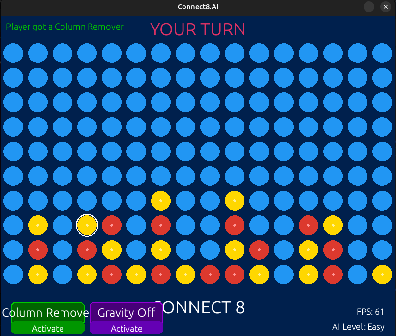

# Connect8.AI - A Strategic Board Game with Adaptive AI

 

## Table of Contents
- [About](#about)
- [Features](#features)
- [Installation](#installation)
- [How to Play](#how-to-play)
- [Demo](#demo)
- [Development](#development)
- [Contributing](#contributing)
- [License](#license)

## About
**Connect8.AI** is a feature-rich evolution of the classic Connect Four game. In this version, players aim to connect **eight** pieces instead of four, compete against a smart AI opponent, and use **power-ups** to gain an edge. Designed with customization, strategy, and fun in mind!

## Features
- 🎮 **Adaptive AI**: Choose from Easy, Medium, and Hard modes
- ✨ **Power-ups**: Use Column Remover and Gravity Off to outsmart your opponent
- ⚙️ **Flexible Grid Sizes**: Customize board dimensions from 10x16 up to 19x23
- 🎨 **Modern UI**: Intuitive interface with animated gameplay
- 🚀 **Smooth Experience**: Optimized for fluid gameplay on large boards

## Installation
1. Make sure you have **Python 3.8 or newer** installed on your system
2. Install required Python libraries:
   - pygame
   - numpy

3. Clone the repository: git clone https://github.com/yourusername/Connect8.AI.git
4. Run the game:
   - cd Connect8.AI
   - python main.py
  
## How to Play
- **Goal**: Connect **8** of your pieces in a row — vertically, horizontally, or diagonally
- **Controls**:
- Click on a column to drop a piece
- Use on-screen buttons to activate available power-ups
- **Player vs AI**: The game alternates turns between the player (Red) and the AI (Yellow)

### Power-ups:
- 🟢 **Column Remover**: Removes all pieces from a column
- 🟣 **Gravity Off**: Place your piece on any cell (not just the bottom)

Only one power-up can be active at a time. Use them wisely!

## Demo
Watch a short demo of Connect8.AI in action:

*(Click the image above to watch the gameplay video)*

## Development

### Built With:
- **Python 3.8+**
- **Pygame** for rendering, event handling, and animations
- **NumPy** for managing the board state and AI logic

### Project Structure
Since the entire project is written in a single script, all the logic resides in: main.py

It contains:
- Game logic (board updates, win checks, power-up effects)
- AI logic (difficulty levels, move selection)
- User interface (menus, buttons, animations)
- Power-up handling (activation, placement, constraints)

## Contributing
Contributions are welcome and appreciated! Feel free to:
- Report bugs
- Suggest enhancements
- Submit pull requests with fixes or features

To contribute:
1. Fork the repository
2. Create a new branch (`feature-xyz`)
3. Commit your changes
4. Open a pull request

## License
This project is licensed under the MIT License. See the [LICENSE](LICENSE) file for details.

